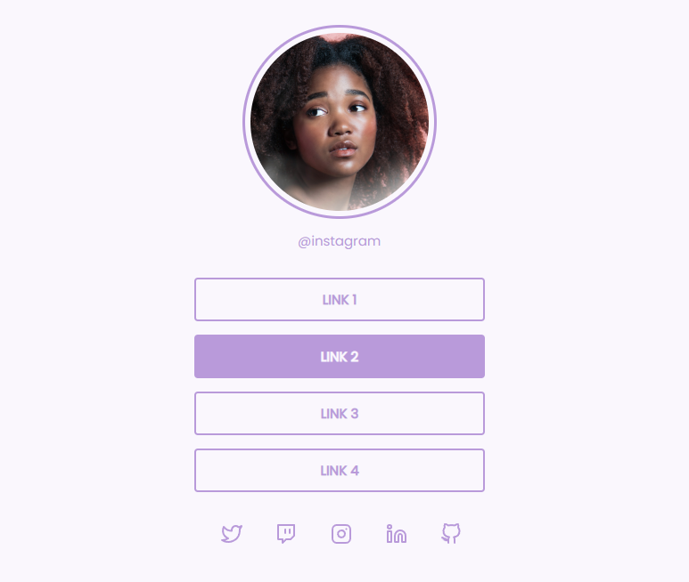

<h1 align="center">Social Tree - Rocketseat 👩‍💻🚀</h1>

### ⚠ About 

This project was developed using HTML and CSS based on the challenge <strong>"Social Tree"</strong> by Rocketseat. Besides, the project design was completely based on planning.

The purpose of creating this project is to practice the basic and necessary tools for building a responsive website: <strong>HTML</strong> and <strong>CSS!</strong>

 

<strong>Challenge planning:</strong>
<a href="https://efficient-sloth-d85.notion.site/Desafio-Social-Tree-a4008e467a3248c4b05c97cf78aea44f">Social Tree on Notion.</a>

<strong>Layout on Figma:</strong>
<a href="https://www.figma.com/file/DVeBKoblVYnT8MoWiGntSu/DD-%2F-Social-links-(Copy)?node-id=0%3A1">Social Tree on Figma.</a>

---
### 🛠 Techs

The following tools were used in the construction of the project:

 - [HTML](https://www.w3schools.com/html/)
 - [CSS](https://www.w3schools.com/css/)

---

### 🌟 Features

- [x] Profile picture
- [x] List of website links
- [x] List of Social Networks
- [x] Responsive
  
  

It's possible change the links and its names directly from page's HTML. Thus, enabling different links for users.

 
<h4 align="center"> 
	 Project completed ✅
</h4>

---
### Author

 

<a href="https://blog.rocketseat.com.br/author/thiago/">
 
  
 <b>Leonardo Oliveira 🚀</b></a> 
 

Made with 💜 by Leonardo Oliveira 👋!

